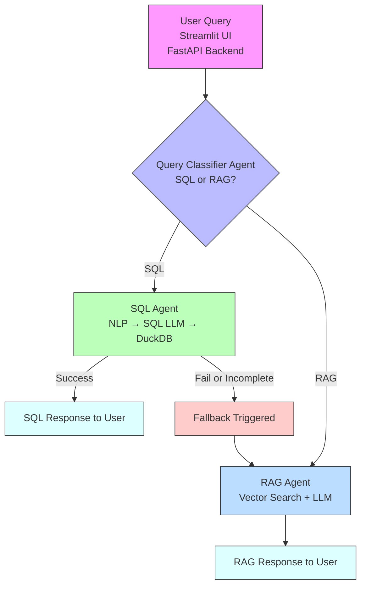

<div align="center">

# 🤖 NeXus — AI Document Assistant

### Role-Based Access Control (RBAC) Chatbot for Enterprise Data


*An intelligent, role-aware enterprise chatbot that answers questions from company documents using RAG (unstructured) and SQL (structured) query routing — powered by Groq LLaMA and ChromaDB.*

</div>

---

## 📌 Overview

NeXus is a full-stack AI document assistant designed to solve the problem of fragmented, siloed information across enterprise departments. Employees log in with their role and ask natural language questions — the system automatically routes each query to the right engine:

- **SQL-type questions** → DuckDB (structured tabular data from CSVs)
- **Text-based questions** → ChromaDB + LLM RAG pipeline (unstructured Markdown docs)
- **Fallback** → If SQL fails, automatically retries via RAG

Access is enforced by **Role-Based Access Control (RBAC)**: each user only receives answers from documents tagged for their role.

---

## ✨ Key Features

### 🔐 Role-Based Access Control
- Users are assigned roles: `C-Level`, `HR`, `Finance`, `Engineering`, `Marketing`, `General`
- Every document is tagged with an access role at upload time
- ChromaDB metadata filters and DuckDB role checks enforce access per query
- **C-Level** users have unrestricted access to all company data

### 🧠 Dual Query Engine
| Query Type | Trigger | Engine |
|---|---|---|
| **RAG** | Text-based, descriptive queries | ChromaDB + Groq LLaMA |
| **SQL** | Tabular/numerical queries | DuckDB in-process SQL |

- **Query Classifier** (LLM-powered) detects intent automatically
- **Fallback mechanism** — SQL failures transparently re-route to RAG

### 📄 Document Management (C-Level)
- Upload `.md` (Markdown) or `.csv` documents via UI
- Documents auto-indexed into ChromaDB (RAG) and DuckDB (SQL)
- Role assignment at upload time

### 📊 RAG Evaluation Framework
- Automated QA pair generation from documents
- LLM-based scoring: **Faithfulness**, **Relevance**, **Conciseness**
- Results exported to CSV for analytics

### 🧪 Automated Testing
- **Backend**: pytest + FastAPI `TestClient`
- **Frontend**: Playwright end-to-end UI tests with video recording

---

## 🛠️ Technology Stack

| Layer | Technology |
|---|---|
| **Frontend** | Streamlit |
| **Backend API** | FastAPI + Uvicorn |
| **LLM** | Groq (`llama-3.1-8b-instant`) via LangChain |
| **Embeddings** | HuggingFace `all-MiniLM-L6-v2` (free, no API key) |
| **Vector Store** | ChromaDB (local persistence) |
| **Structured DB** | DuckDB (in-process SQL) + SQLite (user/role metadata) |
| **Auth** | HTTP Basic Auth + bcrypt password hashing |
| **Testing** | pytest, Playwright |

---

## 🧠 System Architecture



- Combines **structured data querying (SQL)** with **unstructured document retrieval (RAG)**
- **Query Classifier** routes each query to the right engine automatically
- **Fallback logic** ensures the user always gets a meaningful response — never a hard error

---

## 🏗️ Project Structure

```
nexus-rbac-chatbot/
├── app/
│   ├── main.py                     # FastAPI backend (auth, routes, upload)
│   ├── ui.py                       # Streamlit frontend
│   ├── rag_utils/
│   │   ├── rag_module.py           # ChromaDB indexer + RAG chain (LangChain)
│   │   ├── csv_query.py            # DuckDB SQL agent
│   │   ├── query_classifier.py     # LLM-based SQL vs RAG router
│   │   └── rag_chain.py            # RAG invocation wrapper
│   └── rag_evaluator/
│       ├── evaluator.py            # RAG quality evaluator
│       ├── eval_summary.py         # Score aggregation
│       ├── eval_merge_role_summary.py  # Role-level evaluation results
│       ├── qa_pairs_openai.csv     # Generated QA pairs
│       ├── evaluation_results_openai.csv
│       └── final_eval_with_roles.csv
│
├── resources/
│   └── data/                       # Source documents (seeded into system)
│       ├── engineering/            # engineering_master_doc.md
│       ├── finance/                # financial_summary.md, quarterly reports
│       ├── general/                # General company policies
│       ├── hr/                     # hr_data.csv
│       └── marketing/              # market reports (Q1–Q4 + annual)
│
├── static/
│   ├── images/                     # UI background images
│   └── uploads/                    # Runtime-uploaded docs (git-ignored)
│
├── tests/
│   ├── conftest.py
│   ├── test_chatbot.py             # pytest API tests
│   ├── test_ui.py                  # Playwright UI tests
│   └── sample_docs/                # Test fixture documents
│
├── assets/style.css                # Custom CSS
├── seed_data.py                    # One-time data seeder
├── fix_duckdb.py                   # DuckDB role normalisation utility
├── requirements.txt
├── pyproject.toml
├── .env.example                    # Environment variable template
└── README.md
```

---

## 🛡️ Roles & Permissions

| Role | Data Access |
|---|---|
| **C-Level** | Full access to all departments |
| **Finance** | Financial reports, quarterly summaries |
| **Marketing** | Campaign data, sales metrics, market reports |
| **HR** | Employee records, payroll, attendance |
| **Engineering** | Architecture docs, system design, technical guidelines |
| **General** | Company policies, FAQs, events |

---

## 💬 Sample Queries

| Role | Sample Question |
|---|---|
| Engineering | *"Give me a summary about the system architecture"* |
| HR | *"Show employees in the Data department with performance rating 5"* |
| Finance | *"What percentage of Vendor Services expense went to marketing?"* |
| Finance | *"What was the net income percentage increase in 2024?"* |
| General | *"What are the leave policies?"* |

---

## 🔮 Future Enhancements

- [ ] **Admin analytics dashboard** — query types, usage heatmaps
- [ ] **Table + text hybrid retrieval** — fuse tabular and narrative context
- [ ] **SQL query caching** — speed up repeated structured queries
- [ ] **OAuth2 / JWT authentication** — replace HTTP Basic Auth
- [ ] **Multi-tenant support** — separate vector namespaces per organisation
- [ ] **Streaming responses** — real-time token streaming in the UI

---

## ⚙️ Quick Start

### 1. Clone the Repository
```bash
git clone https://github.com/your-username/nexus-rbac-chatbot.git
cd nexus-rbac-chatbot
```

### 2. Create a Virtual Environment
```bash
python -m venv .venv

# Windows
.venv\Scripts\activate

# Linux / macOS
source .venv/bin/activate
```

### 3. Install Dependencies
```bash
pip install -r requirements.txt
```

### 4. Configure API Keys
Copy `.env.example` to `.env` and add your Groq API key (free at [console.groq.com](https://console.groq.com)):
```dotenv
GROQ_API_KEY=your_groq_api_key_here
```

### 5. Seed Initial Data
```bash
python seed_data.py
```

### 6. Run the Application

**Terminal 1 — FastAPI Backend:**
```bash
uvicorn app.main:app --reload
```

**Terminal 2 — Streamlit Frontend:**
```bash
streamlit run app/ui.py
```

Open: **`http://localhost:8501`**

---

## 🔑 Default Credentials

| Username | Password | Role |
|---|---|---|
| `admin` | `admin123` | C-Level (full access) |
| `Tony` | `password123` | Engineering |
| `Bruce` | `securepass` | Marketing |
| `Sam` | `financepass` | Finance |
| `Natasha` | `hrpass123` | HR |
| `Nolan` | `nolan123` | General |

---

## 🧪 Running Tests

**Backend API tests:**
```bash
pytest tests/test_chatbot.py -v --html=report.html
```

**Frontend Playwright tests** (requires both servers running):
```bash
pytest tests/test_ui.py --headed
```

**RAG Evaluation:**
```bash
python app/rag_evaluator/evaluator.py
```

---

## 📝 License

This project is licensed under the **MIT License** — see the [LICENSE](LICENSE) file for details.

---

## 👤 Author

**Jay Patel**

---

<div align="center">
  <sub>Powered by NeXus · Built with FastAPI, Streamlit & LangChain</sub>
</div>
